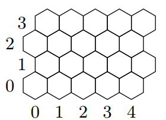

# MovHex: Optimal Route Calculator
Final project for the Algorithms and Data Structures module of the Algorithms and Principles of Computer Science course @ PoliMi, A.Y. 2024/2025.

Final grade: **24/30**

The project was evaluated through automated tests considering both correctness and computational efficiency.

## Project Overview
Movhex is a forward-thinking transportation company operating a vast fleet of vehicles across a wide geographical area. To minimize operational expenses and improve logistics, this project implements a highly optimized, specialized program designed to calculate the most cost-effective travel routes for their fleet. 

## The Map Structure
The environment is modeled as a rectangular grid of hexagonal tiles. 

Each hexagon connects to up to six neighboring tiles (excluding map borders). Vehicles navigate this terrain by traveling land routes between adjacent hexagons or by utilizing dynamically established one-way air routes. Every single tile has an associated "exit cost" which acts as a weight representing the difficulty or expense of traveling out of that specific location.



## Implementation Details
The project is implemented entirely in **C**, prioritizing performance and low-level memory management. It relies on advanced data structures to ensure rapid execution, even on large-scale maps:

*   **Coordinate System:** While the initial setup instantiates the map as a standard 2D grid using offset coordinates (column and row), the program seamlessly converts these into **Cubic Coordinates** (`q`, `r`, `s`) under the hood. This transformation significantly simplifies the mathematical calculation of distances between any two hexagonal tiles, akin to a hexagonal Manhattan distance.
*   **Pathfinding Algorithm:** To reliably compute the absolute lowest cost path between a starting node and a destination, the program utilizes **Dijkstra's Algorithm**.
*   **Priority Queue (Min-Heap):** To ensure Dijkstra's algorithm runs at peak efficiency, it is backed by a custom-built Min-Heap Priority Queue. This data structure guarantees that the node with the lowest accumulated travel cost is always processed next, drastically reducing the search space and execution time.
*   **Dynamic Memory Management:** All major structures—from the core map matrix to the fluctuating array of air routes—are dynamically allocated (`malloc`) and rigorously freed. This prevents memory leaks and allows the program to scale flexibly based on the user-defined grid dimensions.

## Supported Commands
The software operates as an interactive terminal application, reading a precise sequence of commands from standard input (`stdin`) and outputting results to standard output (`stdout`). 

*   `init <columns> <rows>`: Initializes (or completely resets) the map with the specified dimensions. Upon creation, all tiles start with a default land exit cost of 1. Returns `OK`.
*   `change_cost <x> <y> <v> <radius>`: Modifies the exit cost of hexagons within a designated `radius` radiating from the center tile at `(x, y)`. The cost adjustment (`v`) scales down proportionally based on the distance from the epicenter. Returns `OK` on success, or `KO` for invalid inputs.
*   `toggle_air_route <x1> <y1> <x2> <y2>`: Toggles a unidirectional air route from a source tile to a destination tile. If the route does not exist, it creates it; if it already exists, it removes it. The cost of a newly established route is derived from the floored average of the existing outgoing air routes and the origin's land exit cost. Returns `OK` or `KO`.
*   `travel_cost <xp> <yp> <xd> <yd>`: The core querying command. It calculates and prints the minimum accumulated cost required to travel from the starting tile to the destination tile. Returns `-1` if the destination is completely unreachable or invalid.

## Expected Execution Example
Below is an example of an expected sequence of commands, the program's output, and an explanation of the system's behavior:

| Command | Response | Comment |
| :--- | :--- | :--- |
| `init 100 100` | `OK` | Initializes a 100x100 map grid. |
| `change_cost 20 -10 10` | `KO` | Fails because an argument is invalid/out of bounds. |
| `change_cost 30 95 5 1` | `OK` | Increases the outgoing connection cost for the single hexagon at (30, 95). |
| `travel_cost 0 0 20 0` | `20` | Calculates the sum of costs traversing by land between these two hexagons. |
| `travel_cost 30 95 30 97` | `12` | Evaluates the cost to cross two connections, factoring in the cost modification from `change_cost`. |
| `travel_cost 20 11 10 20` | `-1` | Indicates the destination is unreachable from the source point. |
| `toggle_air_route 0 0 20 0` | `OK` | Successfully establishes a new one-way air route between the two hexagons. |
| `travel_cost 0 0 20 0` | `1` | The travel cost drops to 1, utilizing the newly created air connection. |
| `toggle_air_route 10 20 10 22` | `OK` | Connects an adjacent, previously unreachable hexagon... |
| `travel_cost 10 20 10 22` | `-1` | ...however, the calculated average cost is 0, so it remains impassable. |
| `toggle_air_route 0 0 20 0` | `OK` | Removes the previously established air route between (0, 0) and (20, 0). |
| `travel_cost 0 0 20 0` | `20` | With the air route removed, the cost reverts to the standard land traversal total. |
| `change_cost 200 20 -10 5` | `KO` | Fails because the argument refers to a non-existent hexagon. |
| `toggle_air_route 200 20 -10 5` | `KO` | Fails because an argument refers to a non-existent hexagon. |
| `travel_cost 200 20 11 20` | `-1` | Fails because an argument refers to a non-existent hexagon. |

## How to Compile and Execute
The program is built using standard C libraries. Because the pathfinding and coordinate transformation logic heavily relies on the `<math.h>` library for functions like `floor`, `fmin`, and `fmax`, it is strictly necessary to link the math library during the compilation process.

### Compilation
Open your terminal and compile the source code using `gcc`, ensuring you append the `-lm` flag:

```bash
gcc -o movhex MovHex.c -lm
```

### Execution
You can run the program in interactive mode or feed it a pre-written text file containing a batch of commands.

**Interactive Mode:**
```bash
./movhex
```
*(Enter commands line by line and press Enter to see the immediate result. Press `Ctrl+D` to send an EOF signal and safely exit the program, which will also free all allocated memory).*

**File Input Mode:**
For automated testing or processing, redirect a file (e.g., `input.txt`) to the program:
```bash
./movhex < input.txt
```
